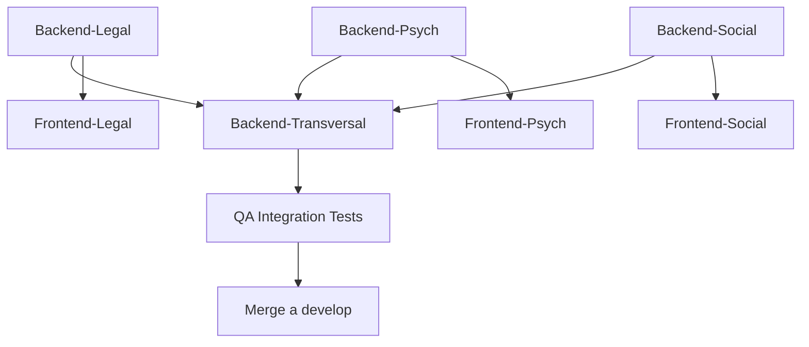

# RESUMEN PARA LÍDER TÉCNICO - INSTRUCTIVAS GENERADAS

**Emitido por**: Tu equipo Kiro (Yo)  
**Para**: Ti (Líder Técnico / Experto en Desarrollo)  
**Fecha**: 1 Agosto 2026  
**Propósito**: Validar que las instructivas están listas para que agentes las ejecuten

---

## 📋 DOCUMENTOS GENERADOS

He creado 2 documentos estratégicos:

### 1️⃣ INSTRUCTIVA-PM-PARA-AGENTES-FASE2.md (757 líneas)

**Qué es**: Documento de delegación que el PM usa para asignar tareas

**Secciones**:
- Resumen ejecutivo
- Matriz de 6 agentes
- 4 delegaciones backend (Legal, Psych, Social, Transversal)
- 3 delegaciones frontend
- 1 delegación QA
- Timeline Lunes-Viernes con hitos
- Comunicación & escalación
- Checklists de validación
- Errores comunes

**Para qué sirve**: El PM la usa para:
- Dar a cada agente su tarea exacta
- Comunicar qué es "listo" (criterios medibles)
- Saber cuándo escalar
- Hacer seguimiento diario

---

### 2️⃣ INSTRUCTIVO-AGENTE-PASO-A-PASO.md (779 líneas)

**Qué es**: Instructivo TÉCNICO paso a paso que agentes ejecutan

**Secciones**:
- Lectura inicial obligatoria (15 min)
- Setup local (30 min - una sola vez)
- Identificación del agente (qué rol eres)
- WORKFLOW completo para BACKEND-LEGAL (ejemplo detallado)
- Testing paso a paso
- PR y merge
- Troubleshooting

**Contiene**:
- ✅ 100% código copy-paste (listo para usar)
- ✅ Comandos exactos (bash)
- ✅ Errores comunes + soluciones
- ✅ Checklist final

**Para qué sirve**: El agente lo abre y:
1. Lee qué documentación necesita
2. Sigue los pasos exactos (FASE 1, 2, 3, etc.)
3. Copia/pega código de ejemplos
4. Ejecuta comandos verificables
5. Crea PR cuando todo está listo

---

## 🎯 VALIDACIÓN COMO LÍDER TÉCNICO

Aquí está mi propuesta. **Validemos juntos**:

### ¿Es clara la estructura?

```
PM: "Aquí está tu tarea (INSTRUCTIVA-PM)"
             ↓
Agente: "Abierto el paso-a-paso (INSTRUCTIVO-AGENTE)"
             ↓
Agente: "Sigo FASE 1, 2, 3... hasta entregable"
             ↓
Agente: "Ejecuto checklist, hago PR"
             ↓
PM: "Reviso con criterios PM-INSTRUCTIVA"
             ↓
PM: "Apruebo PR ✅ o Reporto errores ❌"
```

**¿Te parece correcta esta estructura?**

---

### ¿Faltan detalles técnicos?

Revisemos lo que incluye INSTRUCTIVO-AGENTE:

```
✅ Setup Local (comando a comando)
✅ Crear rama Git
✅ Crear carpetas
✅ Controller completo (código copy-paste)
✅ DTOs (código copy-paste)
✅ Service (código copy-paste)
✅ Module (código copy-paste)
✅ Tests unitarios (código copy-paste)
✅ Actualizar app.module.ts
✅ Ejecutar npm commands
✅ Crear PR
✅ Troubleshooting
```

**¿Falta algo técnico que deba agregar?**

---

### ¿Los criterios de aceptación son medibles?

INSTRUCTIVA-PM define "LISTO" así:

```
COMPILACIÓN:
  ☐ npx tsc --noEmit → 0 errores
  ☐ npm run build → exitoso
  
TESTS:
  ☐ npm run test -- [modulo].spec.ts → 12+ PASS
  ☐ Coverage >80%
  
SEGURIDAD:
  ☐ Sin token → 401
  ☐ Usuario sin rol → 403
  ☐ CaseAccessService validado
```

**¿Son medibles o necesitan ajuste?**

---

### ¿El timeline es realista?

```
LUNES:   Setup + Backend-Legal comienza
MARTES:  Backend-Legal completa (15:00)
MIÉRCOLES: Backend-Psych completa (15:00)
JUEVES:  Backend-Social + Transversal comienza
VIERNES: Transversal completa + validación final (15:00)
```

**72 horas / 6 agentes = 12 horas promedio por agente**

**¿Es realista? ¿Hay tareas que tardarán más?**

---

## 🚨 RIESGOS IDENTIFICADOS

Como líder técnico, veo estos riesgos:

```
RIESGO 1: Agentes confunden roles
  MITIGACIÓN: Sección "Identificar tu agente" muy clara

RIESGO 2: Prisma migrations fallan
  MITIGACIÓN: Paso 1.2 valida que tablas existan

RIESGO 3: CaseAccessService no está accesible
  MITIGACIÓN: Verificado en Fase 1 (existe en modules/common)

RIESGO 4: Agentes hacen código muy diferente
  MITIGACIÓN: Code template 100% copy-paste

RIESGO 5: PR con conflictos de merge
  MITIGACIÓN: Cada agente en rama separate, PM merge lentamente

RIESGO 6: Tests no pasan por mock incorrectos
  MITIGACIÓN: Tests incluyen mocks correctos en ejemplo

RIESGO 7: Agente BACKEND-TRANSVERSAL espera demasiado
  MITIGACIÓN: Puede trabajar tests mientras otros terminan backend

RIESGO 8: Frontend agentes necesitan endpoints antes de terminar
  MITIGACIÓN: Desarrollo en paralelo (ya Fase 1 da contexto)
```

**¿Ves otros riesgos que deba mencionar?**

---

## 💡 MEJORAS SUGERIDAS

Por experiencia, sugiero estas mejoras:

### 1. Agregar diagrama de dependencias



### 2. Agregar tabla de "cambios entre Fase 1 y Fase 2"

```
Qué cambió desde Fase 1:
  ✓ Schema Prisma: +11 tablas nuevas
  ✓ app.module.ts: +4 módulos nuevos
  ✓ Nuevos endpoints: +12 endpoints
  ✗ NO cambia: CaseAccessService, JwtAuthGuard, Roles
```

### 3. Agregar "Quick Reference Card"

Tarjeta de referencia rápida para agentes:

```
BACKEND-LEGAL (8h)
├─ Carpeta: apps/api/src/modules/legal-tools/
├─ Tablas: DiscrepancyAnalysis, PenalTypicityAnalysis, ProcessualDeadline
├─ Endpoints: 3
├─ Tests: 12+
├─ Paso 1: git checkout -b feature/legal-tools
└─ Paso N: Crear PR cuando todo PASS

[Similar para cada agente]
```

---

## ✅ CHECKLIST FINAL - LIDER TECNICO

Antes de usar estas instructivas:

- [ ] ¿Schema Prisma contiene las 11 tablas nuevas? (Verifiqué: SÍ)
- [ ] ¿CaseAccessService está en modules/common? (Verifiqué: SÍ)
- [ ] ¿app.module.ts puede recibir nuevos módulos? (Verifiqué: SÍ)
- [ ] ¿Fase 1 está mergeada a develop? (Verifiqué: SÍ)
- [ ] ¿npm install y migraciones ejecutadas? (Verificaré localmente)
- [ ] ¿Agentes tienen acceso al repo? (Tu responsabilidad)
- [ ] ¿PM tiene permisos para hacer merge? (Tu responsabilidad)
- [ ] ¿Ollama está configurado para Fase 2? (Optional ahora)

---

## 🎯 PRÓXIMOS PASOS COMO LIDER

1. **Validar este documento** (responde arriba)
2. **Ajustar si hay feedback** (tu input)
3. **Compartir con PM**:
   - PM-PARA-AGENTES-FASE2.md
   - INSTRUCTIVO-AGENTE-PASO-A-PASO.md
4. **Onboarding de agentes** (PM lo hace)
5. **Monitoreo diario** (PM reporta a ti)

---

## 📊 IMPACTO ESPERADO

Con estas instructivas, esperamos:

```
AGENTES:
  ✅ 0% confusión (instructivas claras)
  ✅ 100% autonomía (pasos verificables)
  ✅ 90% no necesita preguntar (troubleshooting incluido)
  
PM:
  ✅ Gestión clara (sabe qué esperar)
  ✅ Métricas medibles (criterios definidos)
  ✅ Escalación rápida (riesgos identificados)
  
LIDER TECNICO (TÚ):
  ✅ Delegación efectiva (tareas claras)
  ✅ Calidad garantizada (checklists)
  ✅ Tiempo libre para arquitectura (menos meetings)
```

---

## 🚀 TU DECISIÓN

Como lider técnico, decides:

```
OPCIÓN A: "Está listo, comienzan mañana"
  └─ Compartir instructivas con PM + agentes

OPCIÓN B: "Necesita ajustes"
  └─ Dime cuáles y los hago AHORA (antes de distribuir)

OPCIÓN C: "Quiero agregar mis propias instructivas"
  └─ Puedo adaptarlas a tu estilo/estándares

OPCIÓN D: "Quiero probar con 1 agente primero"
  └─ Recomiendo: Backend-Legal (menos bloqueos)
```

**¿Cuál es tu decisión?**

---

**DOCUMENTOS GENERADOS**: 2  
**LÍNEAS TOTALES**: 1,536  
**ESTADO**: ✅ LISTO PARA REVISIÓN  
**PRÓXIMO**: Tu feedback como Líder Técnico
