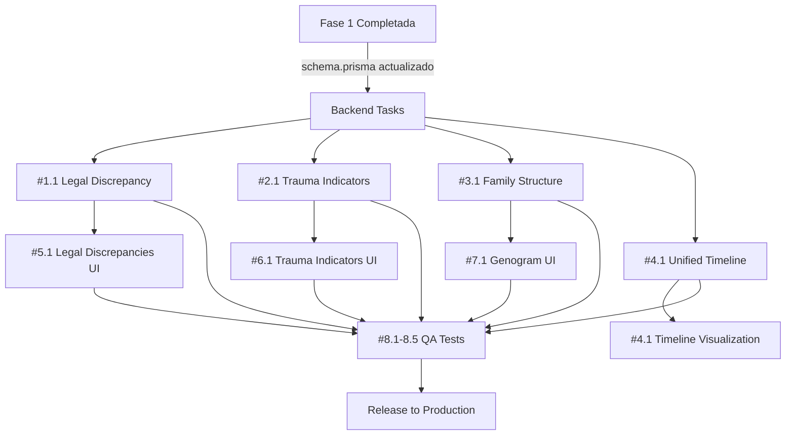

# MATRIZ DETALLADA DE DELEGACIONES — FASE 2

**Documento**: Matriz interactiva de tareas, asignaciones y tracking  
**Actualización**: Diaria (PM es responsable)  
**Formato**: Markdown + Mermaid (para visualización)

---

## 📊 VISTA GENERAL FASE 2

```
FASE 2: 11 Módulos Especializados
├─ Grupo Legal (3 módulos, 3 endpoints)
├─ Grupo Psicológico (3 módulos, 4 endpoints)
├─ Grupo Social (3 módulos, 3 endpoints)
└─ Grupo Transversal (2 módulos, 2 endpoints)

Total: 12 endpoints, 11 tablas BD, 60+ tests
Duración: 5 días de trabajo (Semana 2)
Team: 6 agentes especializados
```

---

## 🎯 DELEGACIONES ESPECÍFICAS POR AGENTE

### AGENTE #1: Backend-Legal (Especialista en Lógica Jurídica)

| Delegación | Módulo | Tarea | Deadline | Prioridad | Bloquea | Status |
|------------|--------|-------|----------|-----------|---------|--------|
| #1.1 | Legal Tools | Backend: Discrepancy Detection | Martes 15:00 | 🔴 Crítica | #2.1, #9.1 | 🟡 Asignado |
| #1.2 | Legal Tools | Backend: Typicality Validation | Martes 18:00 | 🔴 Crítica | #2.1, #9.1 | 🟡 Asignado |
| #1.3 | Legal Tools | Backend: Process Deadlines | Miércoles 12:00 | 🔴 Crítica | #2.2, #9.1 | 🟡 Asignado |

**Deliverables Esperados**:
```
apps/api/src/modules/legal-tools/
├── legal-tools.controller.ts (3 endpoints)
├── legal-tools.service.ts (lógica análisis)
├── legal-tools.module.ts
├── dto/
│   ├── create-discrepancy.dto.ts
│   ├── create-typicality.dto.ts
│   └── create-deadline.dto.ts
└── legal-tools.service.spec.ts (15+ tests)
```

**Criterio de Aceptación**:
- [ ] `npx tsc --noEmit` → 0 errores
- [ ] `npm run test -- legal-tools.service.spec.ts` → 15+ PASS
- [ ] Swagger documentado con 3 endpoints
- [ ] PR revisada y sin cambios requeridos
- [ ] Tiempo: < 8 horas

---

### AGENTE #2: Backend-Psych (Especialista en Lógica Psicológica)

| Delegación | Módulo | Tarea | Deadline | Prioridad | Bloquea | Status |
|------------|--------|-------|----------|-----------|---------|--------|
| #2.1 | Psych Tools | Backend: Trauma Indicators | Miércoles 15:00 | 🔴 Crítica | #5.1, #9.2 | 🟡 Asignado |
| #2.2 | Psych Tools | Backend: Risk Scales Calculation | Jueves 10:00 | 🔴 Crítica | #5.2, #9.2 | 🟡 Asignado |
| #2.3 | Psych Tools | Backend: Clinical Translation | Jueves 14:00 | 🟠 Alta | #5.3, #9.2 | 🟡 Asignado |

**Deliverables Esperados**:
```
apps/api/src/modules/psychological-tools/
├── psychological-tools.controller.ts (4 endpoints)
├── psychological-tools.service.ts (escalas + trauma + traducción)
├── psychological-tools.module.ts
├── dto/
│   ├── analyze-trauma.dto.ts
│   ├── calculate-scale.dto.ts
│   └── translate-clinical.dto.ts
└── psychological-tools.service.spec.ts (20+ tests)
```

**Criterio de Aceptación**:
- [ ] `npx tsc --noEmit` → 0 errores
- [ ] `npm run test -- psychological-tools.service.spec.ts` → 20+ PASS
- [ ] Swagger documentado con 4 endpoints
- [ ] Integración con Ollama verificada
- [ ] Tiempo: < 10 horas

---

### AGENTE #3: Backend-Social (Especialista en Lógica Social)

| Delegación | Módulo | Tarea | Deadline | Prioridad | Bloquea | Status |
|------------|--------|-------|----------|-----------|---------|--------|
| #3.1 | Social Tools | Backend: Family Structure | Miércoles 18:00 | 🟠 Alta | #8.1, #9.3 | 🟡 Asignado |
| #3.2 | Social Tools | Backend: Vulnerability Assessment | Jueves 11:00 | 🟠 Alta | #8.2, #9.3 | 🟡 Asignado |
| #3.3 | Social Tools | Backend: Environmental Factors | Jueves 15:00 | 🟠 Alta | #8.3, #9.3 | 🟡 Asignado |

**Deliverables Esperados**:
```
apps/api/src/modules/social-tools/
├── social-tools.controller.ts (3 endpoints)
├── social-tools.service.ts (genograma + vulnerabilidad + ambiente)
├── social-tools.module.ts
├── dto/
│   ├── generate-family-structure.dto.ts
│   ├── assess-vulnerability.dto.ts
│   └── analyze-environment.dto.ts
└── social-tools.service.spec.ts (15+ tests)
```

**Criterio de Aceptación**:
- [ ] `npx tsc --noEmit` → 0 errores
- [ ] `npm run test -- social-tools.service.spec.ts` → 15+ PASS
- [ ] Integración con Google Maps Mock
- [ ] Genograma genera JSON válido
- [ ] Tiempo: < 8 horas

---

### AGENTE #4: Backend-Transversal (Especialista en Integración)

| Delegación | Módulo | Tarea | Deadline | Prioridad | Bloquea | Status |
|------------|--------|-------|----------|-----------|---------|--------|
| #4.1 | Transversal | Backend: Unified Timeline | Jueves 12:00 | 🟠 Alta | #9.4 | 🟡 Asignado |
| #4.2 | Transversal | Backend: Anonimization | Viernes 10:00 | 🟠 Alta | #9.4 | 🟡 Asignado |

**Deliverables Esperados**:
```
apps/api/src/modules/transversal-tools/
├── transversal-tools.controller.ts (2 endpoints)
├── transversal-tools.service.ts (timeline + anonimización)
├── transversal-tools.module.ts
├── dto/
│   ├── get-timeline.dto.ts
│   └── anonymize-report.dto.ts
└── transversal-tools.service.spec.ts (10+ tests)
```

**Criterio de Aceptación**:
- [ ] `npx tsc --noEmit` → 0 errores
- [ ] `npm run test -- transversal-tools.service.spec.ts` → 10+ PASS
- [ ] Timeline incluye todos los eventos en orden cronológico
- [ ] PDF anonimizado válido (sin datos sensibles)
- [ ] Tiempo: < 6 horas

---

### AGENTE #5: Frontend-Legal (Especialista en UI Jurídica)

| Delegación | Módulo | Tarea | Deadline | Prioridad | Bloquea | Status |
|------------|--------|-------|----------|-----------|---------|--------|
| #5.1 | Legal Tools UI | Frontend: Discrepancies Dashboard | Jueves 14:00 | 🟠 Alta | — | 🟡 Asignado |
| #5.2 | Legal Tools UI | Frontend: Legal Alerts | Viernes 11:00 | 🟠 Alta | — | 🟡 Asignado |

**Deliverables Esperados**:
```
apps/web/app/(dashboard)/
├── panel/
│   ├── discrepancias-legales/
│   │   └── page.tsx (tabla + filtros)
│   └── alertas-procesales/
│       └── page.tsx (cards + timeline)
├── components/
│   ├── DiscrepancyCard.tsx
│   ├── LegalAlertsList.tsx
│   └── TypeCheckBadge.tsx
└── __tests__/
    └── legal-tools.test.tsx (5+ tests)
```

**Criterio de Aceptación**:
- [ ] `npx tsc --noEmit --skipLibCheck` → 0 errores
- [ ] Rutas accesibles (http://localhost:3000/panel/discrepancias-legales)
- [ ] Guard por rol: solo ABOGADO + ADMINISTRADOR
- [ ] Datos cargan desde API
- [ ] Loading state visible
- [ ] Error handling robusto
- [ ] Responsive en mobile + desktop
- [ ] Lighthouse > 80
- [ ] Tiempo: < 5 horas

---

### AGENTE #6: Frontend-Psych (Especialista en UI Psicológica)

| Delegación | Módulo | Tarea | Deadline | Prioridad | Bloquea | Status |
|------------|--------|-------|----------|-----------|---------|--------|
| #6.1 | Psych Tools UI | Frontend: Trauma Indicators | Jueves 16:00 | 🟠 Alta | — | 🟡 Asignado |
| #6.2 | Psych Tools UI | Frontend: Risk Scales Viz | Viernes 13:00 | 🟠 Alta | — | 🟡 Asignado |

**Deliverables Esperados**:
```
apps/web/app/(dashboard)/
├── panel/
│   ├── indicadores-trauma/
│   │   └── page.tsx (radar chart + lista)
│   └── escalas-psicologicas/
│       └── page.tsx (barras + puntuaciones)
├── components/
│   ├── TraumaIndicatorCard.tsx
│   ├── RiskScaleChart.tsx
│   └── ScaleInterpretation.tsx
└── __tests__/
    └── psych-tools.test.tsx (5+ tests)
```

**Criterio de Aceptación**:
- [ ] Gráficos renderean correctamente (Recharts o Chart.js)
- [ ] Guard por rol: solo PSICOLOGO + ADMINISTRADOR
- [ ] API calls mocked en tests
- [ ] Responsive en mobile
- [ ] Performance Lighthouse > 80
- [ ] Tiempo: < 5 horas

---

### AGENTE #7: Frontend-Social (Especialista en UI Social)

| Delegación | Módulo | Tarea | Deadline | Prioridad | Bloquea | Status |
|------------|--------|-------|----------|-----------|---------|--------|
| #7.1 | Social Tools UI | Frontend: Family Genogram | Viernes 10:00 | 🟠 Alta | — | 🟡 Asignado |
| #7.2 | Social Tools UI | Frontend: Vulnerability Report | Viernes 14:00 | 🟠 Alta | — | 🟡 Asignado |

**Deliverables Esperados**:
```
apps/web/app/(dashboard)/
├── panel/
│   ├── genograma-familiar/
│   │   └── page.tsx (SVG tree + interactivo)
│   └── vulnerabilidad-socioecon/
│       └── page.tsx (gauge + factores)
├── components/
│   ├── FamilyTree.tsx
│   ├── VulnerabilityGauge.tsx
│   └── SupportProgramsList.tsx
└── __tests__/
    └── social-tools.test.tsx (5+ tests)
```

**Criterio de Aceptación**:
- [ ] Genograma renderiza SVG (d3.js o visx)
- [ ] Guard por rol: solo SOCIAL + ADMINISTRADOR
- [ ] JSON del árbol familiar formatea correctamente
- [ ] Responsive
- [ ] Tiempo: < 5 horas

---

### AGENTE #8: QA-Integration (Especialista en Testing)

| Delegación | Módulo | Tarea | Deadline | Prioridad | Bloquea | Status |
|------------|--------|-------|----------|-----------|---------|--------|
| #8.1 | QA | Integration Tests: Legal Tools | Viernes 11:00 | 🟠 Alta | — | 🟡 Asignado |
| #8.2 | QA | Integration Tests: Psych Tools | Viernes 12:00 | 🟠 Alta | — | 🟡 Asignado |
| #8.3 | QA | Integration Tests: Social Tools | Viernes 13:00 | 🟠 Alta | — | 🟡 Asignado |
| #8.4 | QA | E2E Tests: Transversal Tools | Viernes 14:00 | 🟠 Alta | — | 🟡 Asignado |
| #8.5 | QA | Performance Baseline | Viernes 15:00 | 🟡 Media | — | 🟡 Asignado |

**Deliverables Esperados**:
```
apps/api/__tests__/
├── legal-tools.e2e.spec.ts (10 tests)
├── psychological-tools.e2e.spec.ts (12 tests)
├── social-tools.e2e.spec.ts (10 tests)
└── transversal-tools.e2e.spec.ts (8 tests)

apps/web/__tests__/
├── e2e/
│   ├── legal-tools.e2e.playwright.ts (5 tests)
│   ├── psych-tools.e2e.playwright.ts (5 tests)
│   └── social-tools.e2e.playwright.ts (5 tests)
└── performance/
    └── baseline.perf.ts (5 benchmarks)
```

**Criterio de Aceptación**:
- [ ] 40+ tests PASS (integration + E2E)
- [ ] Coverage >= 80% en todos los módulos
- [ ] No hay regressions en Fase 1
- [ ] Performance: todos endpoints < 500ms
- [ ] Security: 0 vulnerabilidades críticas
- [ ] Tiempo: < 8 horas

---

## 📈 TRACKER DE PROGRESO SEMANAL

### Lunes (Día 1) - Kickoff

```
Status: 🟢 INICIADO

Actividades:
- [ ] 09:00 - Reunión kickoff (todos los agentes)
- [ ] 09:30 - Distribuir contexto y credenciales
- [ ] 10:00 - Agente Backend-Legal comienza #1.1
- [ ] 10:30 - Agente Backend-Psych comienza #2.1 setup
- [ ] 14:00 - First checkpoint: estado inicial

Progreso global: 0% (0/11 módulos)
Bloqueadores conocidos: Ninguno
```

### Martes (Día 2) - Backend Heavy

```
Status: 🟡 EN PROGRESO

Hitos esperados:
- Backend-Legal: #1.1 50%, #1.2 20%
- Backend-Psych: #2.1 50%, setup terminado
- Backend-Social: #3.1 setup + 10%

Progreso global: 20% (2/11 módulos iniciados)
Checkpoint 14:00: Status update + bloqueadores

Posibles riesgos:
- Schema Prisma incompleta → resolver antes de 10:00
- Ollama no responde → verificar y resetear
```

### Miércoles (Día 3) - Backend Final

```
Status: 🟡 EN PROGRESO

Hitos esperados:
- Backend-Legal: #1.1 DONE, #1.2 DONE, #1.3 50%
- Backend-Psych: #2.1 DONE, #2.2 50%
- Backend-Social: #3.1 50%, #3.2 20%
- Backend-Transversal: setup + #4.1 10%

Progreso global: 40% (4/11 módulos completados)
Merges: Legal Tools → develop si tests PASS

Frontend comienza:
- 10:00 Frontend-Legal inicia #5.1
- 14:00 Frontend-Psych inicia #6.1
- 16:00 Frontend-Social inicia #7.1
```

### Jueves (Día 4) - Frontend + Backend Final

```
Status: 🟡 EN PROGRESO

Hitos esperados:
- Backend: #1.3 DONE, #2.3 DONE, #3.3 DONE, #4.1 DONE
- Frontend: #5.1 50%, #6.1 50%, #7.1 50%

Progreso global: 65% (7/11 módulos completados)
Merges: Psych Tools, Social Tools, Transversal Tools → develop

Validación:
- 12 endpoints funcionales en Swagger ✅
- 40+ tests PASS ✅
```

### Viernes (Día 5) - Frontend Final + QA

```
Status: 🟢 COMPLETANDO

Hitos esperados:
- Frontend: #5.2 DONE, #6.2 DONE, #7.2 DONE
- QA: #8.1 DONE, #8.2 DONE, #8.3 DONE, #8.4 DONE, #8.5 DONE

Progreso global: 100% (11/11 módulos completados)

Actividades finales:
- 09:00 Merge final: Frontend-Legal, Frontend-Psych, Frontend-Social
- 11:00 Merge final: QA tests + performance baseline
- 14:00 Full regression test suite PASS
- 16:00 Demo a stakeholders (opcional)
- 17:00 Cierre + lecciones aprendidas

Entrega:
- [ ] `develop` branch actualizado con 11 módulos nuevos
- [ ] Documentación actualizada
- [ ] Changelog escrito
- [ ] Release notes preparados
```

---

## 🔄 DEPENDENCIAS ENTRE TAREAS



---

## 📞 MATRIZ DE SOPORTE

| Agente | Mentores | Bloqueadores Típicos | Escalación |
|--------|----------|---------------------|-----------|
| Backend-Legal | Tech Lead, CTO | Schema incompleto, Ollama caido | Tech Lead (4h) |
| Backend-Psych | Backend-Legal (peer), Tech Lead | Escalas incorrectas, LLM responses | CTO (6h) |
| Backend-Social | Backend-Legal (peer), Tech Lead | Google Maps API, validaciones | Tech Lead (4h) |
| Backend-Transversal | Todos (depende de ellos) | Relaciones entre módulos | Tech Lead (8h) |
| Frontend-Legal | PM, Tech Lead | Guards, API integration | PM (2h) |
| Frontend-Psych | Frontend-Legal (peer), PM | Charts/graphs rendering | Tech Lead (3h) |
| Frontend-Social | Frontend-Legal (peer), PM | SVG rendering | Tech Lead (3h) |
| QA-Integration | Tech Lead, DevOps | Performance benchmarks | DevOps (4h) |

---

**Última actualización**: 2026-08-01  
**Próxima actualización**: Diaria (PM responsable)  
**Generado por**: Kiro Project Management Agent

