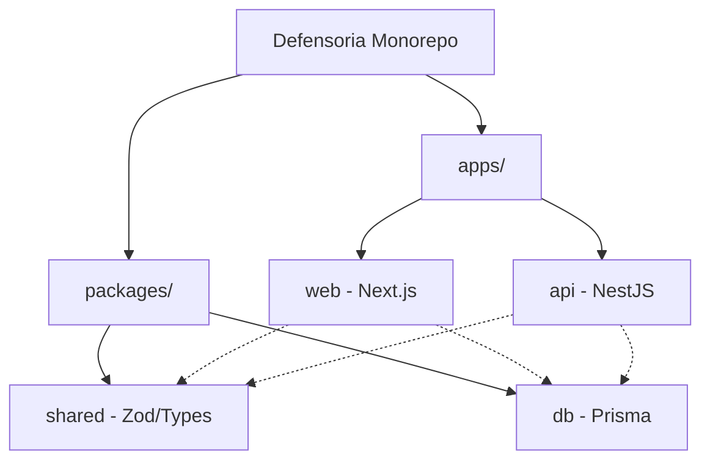
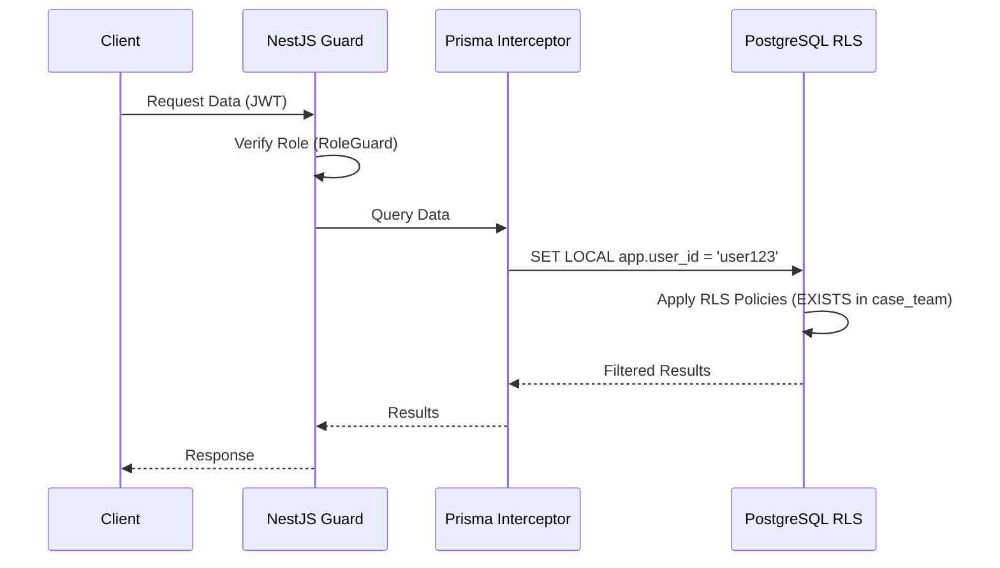

# Architecture Decision Record (ADR) - Foundation

This document consolidates the foundational technical decisions made for the DNA case management system.

## ADR-001: Monorepo with Turborepo
- **Status**: Accepted
- **Date**: 2026-07-30
- **Context**: The project consists of multiple interconnected applications and packages (frontend, backend, database client, shared types). We need an efficient way to manage them together.
- **Decision**: Use a monorepo approach with Turborepo + npm workspaces.
- **Rationale**: Turborepo provides caching, parallel pipeline execution, and a better developer experience for a project with 4 packages (`apps/web`, `apps/api`, `packages/shared`, `packages/db`). This improves upon plain npm workspaces used in previous patterns (e.g., juris).
- **Consequences**: Faster CI/CD builds, easier dependency management, and unified tooling across all project boundaries.

## ADR-002: NestJS over Express
- **Status**: Accepted
- **Date**: 2026-07-30
- **Context**: The backend needs to handle complex logic, strict role-based access control (RBAC), and immutable audit logging.
- **Decision**: Use NestJS 11 for the backend instead of raw Express.
- **Rationale**: NestJS enforces a structured module system that prevents "spaghetti code." It provides built-in guards for RBAC, interceptors for audit logging, and decorators for clean role-based access. Given the complex RBAC (6 roles × assignment-based access), this structured approach is superior.
- **Consequences**: Steeper learning curve compared to Express, but yields a more maintainable, testable, and secure codebase in the long run.

## ADR-003: Next.js 16 with App Router
- **Status**: Accepted
- **Date**: 2026-07-30
- **Context**: The frontend application needs to serve various user roles with distinct interfaces and handle complex data interactions.
- **Decision**: Use Next.js 16 with the App Router (React 19). Route groups by role: `(jefatura)`, `(abogado)`, `(psicologo)`, `(social)`, `(secretaria)`, `(auth)`.
- **Rationale**: Server Components allow efficient rendering for data-heavy lists, while Client Components handle interactive forms. Route groups provide clean organizational boundaries without affecting the URL structure.
- **Consequences**: Tightly couples the frontend to Next.js specific paradigms, but offers excellent performance and developer experience.

## ADR-004: shadcn/ui as UI library
- **Status**: Accepted
- **Date**: 2026-07-30
- **Context**: A robust, accessible, and customizable UI component library is required.
- **Decision**: Adopt shadcn/ui (Radix UI primitives + CVA + tailwind-merge).
- **Rationale**: It provides accessible, typed components that are fully customizable with DNA design tokens. It integrates well with the chosen ecosystem: `lucide-react` (icons), `framer-motion` (animations), `sonner` (toasts), `recharts` (charts), `@tanstack/react-table` (data tables), and `react-hook-form` + `zod` (forms).
- **Consequences**: Components are owned in the codebase rather than imported as a node module, providing maximum flexibility at the cost of slightly more boilerplate.

## ADR-005: Tailwind CSS v4 CSS-first
- **Status**: Accepted
- **Date**: 2026-07-30
- **Context**: A styling solution that supports modern CSS features and custom design tokens is needed.
- **Decision**: Use Tailwind CSS v4 with a CSS-first approach (no `tailwind.config.js`). Use the OKLCH color space and CSS custom properties.
- **Rationale**: Simplifies configuration and leverages modern CSS capabilities. Design tokens from the master document will map directly to shadcn semantic tokens. Custom tokens will be used for risk levels (`--risk-low`, `--risk-medium`, `--risk-high`).
- **Consequences**: Adopting bleeding-edge Tailwind v4 patterns; developers must use CSS variables for theme customization instead of JS configuration.

## ADR-006: PostgreSQL 16
- **Status**: Accepted
- **Date**: 2026-07-30
- **Context**: A relational database is needed to store highly structured data with strict integrity requirements.
- **Decision**: Use PostgreSQL 16, running in Docker for development (port 5435).
- **Rationale**: Chosen for improved Row-Level Security (RLS) performance, better JSON operations, and `MERGE` statement support. Port 5434 prevents collision with existing projects.
- **Consequences**: Requires Postgres-specific knowledge, but offers robust security and advanced relational features.

## ADR-007: Prisma in packages/db
- **Status**: Accepted
- **Date**: 2026-07-30
- **Context**: Both the frontend and backend need database access or types derived from the database schema.
- **Decision**: Create a separate package `@defensoria/db` containing the Prisma schema and generated client.
- **Rationale**: Importing this package in both `apps/web` and `apps/api` avoids duplicating Prisma schemas and generated clients across boundaries.
- **Consequences**: Centralized database schema management and unified typings across the monorepo.

## ADR-008: UUID v7 for primary keys
- **Status**: Accepted
- **Date**: 2026-07-30
- **Context**: A strategy for generating primary keys is required.
- **Decision**: Use UUID v7 instead of CUIDs or standard auto-incrementing integers.
- **Rationale**: UUID v7 is chronologically sortable (better for B-tree index fragmentation), globally unique, and has a built-in timestamp. It can be generated by the DB (`gen_random_uuid()` if supported/patched) or application-side.
- **Consequences**: Slightly larger storage footprint than integers, but enables distributed ID generation without sequence bottlenecks and improves indexing performance over UUID v4.

## ADR-009: JWT local auth with bcrypt
- **Status**: Accepted
- **Date**: 2026-07-30
- **Context**: Authentication mechanisms must be defined, noting the lack of an institutional identity provider.
- **Decision**: Implement local authentication using JWT and bcrypt for password hashing. Accounts are managed by Jefatura.
- **Rationale**: Without SSO, a robust local strategy is needed. 2FA will be optional in Phase 1 and mandatory in Phase 2 for evidence-access roles. The auth module is designed with a strategy pattern to allow adding SAML/OIDC in the future without a complete rewrite.
- **Consequences**: The application must handle password resets, account lockouts, and security best practices directly.

## ADR-010: MinIO on-premise for evidence storage
- **Status**: Accepted
- **Date**: 2026-07-30
- **Context**: Storing sensitive legal and clinical evidence securely.
- **Decision**: Use on-premise MinIO for object storage with a 50MB per file limit, SHA-256 hash integrity checks, and restricted formats (PDF, JPG, PNG, DOCX, MP3, MP4).
- **Rationale**: Legal counsel mandates that NNA (Niños, Niñas y Adolescentes) data cannot leave municipal servers. MinIO provides an S3-compatible API, meaning the application code won't need to change if the municipality eventually migrates to a secure cloud.
- **Consequences**: Requires managing local storage infrastructure and backups, but ensures strict data sovereignty.

## ADR-011: Two-layer RBAC (NestJS Guards + PostgreSQL RLS)
- **Status**: Accepted
- **Date**: 2026-07-30
- **Context**: Access control must be extremely secure, verifying both the user's role and their specific case assignments.
- **Decision**: Implement a two-layer security model: Application guards (NestJS) for route protection, and PostgreSQL Row-Level Security (RLS) for data filtering.
- **Rationale**: Guards handle broad access (e.g., "is this user a psychologist?"). RLS ensures users only see data they are assigned to (e.g., "is this psychologist assigned to this specific case?"). Jefatura sees all cases. RLS will use direct `EXISTS` on `case_team` tables. A Prisma interceptor will set `SET LOCAL app.user_id` per transaction.
- **Consequences**: Security is enforced at the database level, preventing data leaks even if an API route is misconfigured.

## ADR-012: Vitest and Playwright for testing
- **Status**: Accepted
- **Date**: 2026-07-30
- **Context**: A testing framework is required for unit, integration, and End-to-End (E2E) browser verification.
- **Decision**: Use Vitest for unit/integration testing and `@playwright/test` for E2E testing in `apps/web` with automated HTML reporting and trace recording.
- **Rationale**: Vitest provides fast unit testing in NestJS and React. Playwright validates role-based UI flows (`apps/web/e2e`). Cloudflare Tunnel (`cloudflared`) is authorized exclusively in dev mode for temporary HTTPS preview of mock/synthetic data.
- **Consequences**: Ensures comprehensive test coverage at both API unit level and full browser interaction level.

## ADR-013: Zod for shared validation
- **Status**: Accepted
- **Date**: 2026-07-30
- **Context**: Data structures need validation on both the frontend and backend.
- **Decision**: Define Zod schemas in `packages/shared`.
- **Rationale**: Schemas can be used by the frontend (via `react-hook-form` resolvers) and the backend (via NestJS pipes) as a single source of truth for DTOs.
- **Consequences**: Reduces code duplication and ensures validation logic is perfectly synchronized between client and server.

## ADR-014: Notifications: in-app + email
- **Status**: Accepted
- **Date**: 2026-07-30
- **Context**: Users need to be alerted about case updates and legal deadlines.
- **Decision**: Implement in-app notifications (topbar badge) with an email fallback.
- **Rationale**: Critical alerts (like legal deadlines) will auto-escalate to Jefatura if not addressed promptly. SMS and WhatsApp integrations are deferred to post-MVP to reduce initial complexity.
- **Consequences**: Requires setting up an email delivery service/SMTP relay, but provides a reliable baseline for notifications.

## ADR-015: Security Token
- **Status**: Accepted
- **Date**: 2026-07-30
- **Context**: Viewing sensitive evidence requires additional verification.
- **Decision**: Require re-authentication with password to obtain a scoped JWT (`evidence:read`, `clinical:read`) with a short TTL (e.g., 15 minutes, configurable by Jefatura).
- **Rationale**: Prevents unauthorized access if a user steps away from an unlocked terminal. On expiry, an overlay hides the content but does not close the view. All emissions and scope usages are logged.
- **Consequences**: Increased friction for users when accessing evidence, but significantly improved security for sensitive NNA data.

## ADR-016: AI: blocked until Phase 3, local by default
- **Status**: Accepted
- **Date**: 2026-07-30
- **Context**: The integration of AI for summarization or assistance is a potential feature, but privacy concerns are paramount.
- **Decision**: AI features are blocked until Phase 3. When implemented, they will use local models by default.
- **Rationale**: No NNA data can be sent to external providers without explicit written legal authorization from the GAM (Gobierno Autónomo Municipal). The default setup will use Ollama with local models (Llama/Mistral) to guarantee data privacy. If authorized later, the system can switch to a cloud provider.
- **Consequences**: Defers complex AI integration and requires substantial local hardware if the local LLM approach is fully adopted in the future.

## ADR-017: Full Docker Containerization for Portability
- **Status**: Accepted
- **Date**: 2026-07-30
- **Context**: The application must run seamlessly on local developer machines, GAM physical servers (on-premise), or private VPS instances without environment-specific setup drift.
- **Decision**: Fully containerize all components using Docker and Docker Compose (`apps/web`, `apps/api`, `PostgreSQL 16`, `MinIO`).
- **Rationale**: Guarantees total portability. Multi-stage Dockerfiles will be created for both `apps/web` (Next.js standalone production build) and `apps/api` (NestJS production build). Development Docker Compose handles local services (`postgres`, `minio`), while Production Docker Compose orchestrates the entire stack behind a unified environment or reverse proxy.
- **Consequences**: Requires maintaining Dockerfiles and Docker Compose files alongside code, but guarantees zero-drift migration between local dev, physical server deployments, and private VPS environments.

