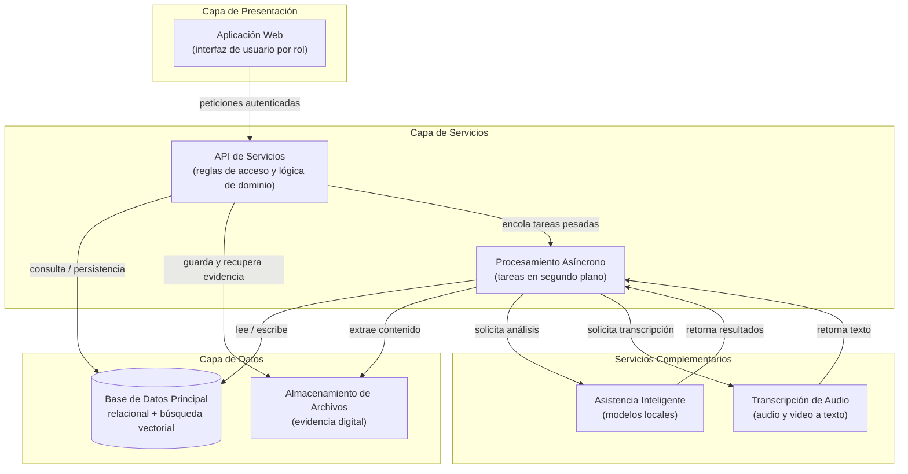
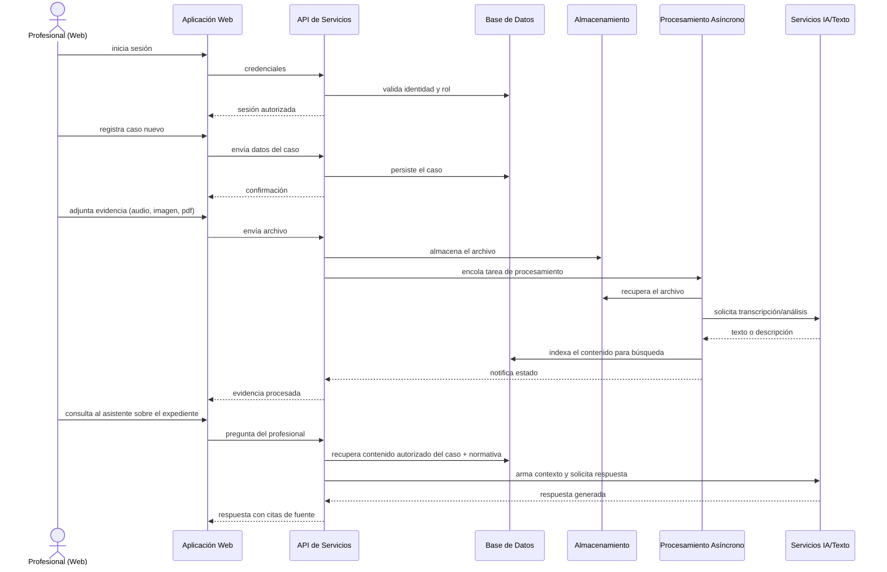

# Documento de Evaluación Técnica - Propiedad Confidencial

# Sistema de Gestión de Casos — Blueprint de Alto Nivel

**Versión**: 1.0 (compartible con terceros) · **Nivel**: Conceptual / Alta Vista
**Propósito**: Describir la arquitectura general del sistema para evaluación técnica externa, preservando la confidencialidad de la implementación.

> **Alcance de este documento**: Describe *qué* hace el sistema y *cómo se conectan sus partes a nivel conceptual. No incluye esquemas de datos, lógica de negocio propietaria, algoritmos internos, configuración de infraestructura, credenciales ni variables de entorno. Esos detalles permanecen reservados.**

---

## 1. Resumen ejecutivo

Sistema web integral para la gestión de expedientes de una Defensoría de la Niñez y Adolescencia: registro de casos, seguimiento por fases, gestión de evidencia, generación de informes profesionales, atención interdisciplinaria (legal, psicológica, social) y consulta de normativa nacional vigente, con soporte de asistencia inteligente sobre el contenido del propio sistema.

**Para el evaluador externo**: la plataforma es un monorepo con dos aplicaciones principales (interfaz web y API de servicios), una base de datos relacional con capacidades vectoriales, almacenamiento de archivos y servicios de inteligencia artificial locales.

---

## 2. Estructura modular general

---

## 3. Descripción de componentes

| Componente | Función conceptual | Observaciones |
|---|---|---|
| **Aplicación Web** | Interfaz de usuario adaptada a cada perfil profesional. Captura de casos, consulta de expedientes, redacción de informes, panel de administración. | Interactúa únicamente con la API; no accede directamente a datos. |
| **API de Servicios** | Puerta de entrada única. Autenticación, autorización por rol, validación, orquestación de operaciones de dominio. | Aplica control de acceso sobre cada expediente de forma individual. |
| **Procesamiento Asíncrono** | Ejecuta tareas pesadas en segundo plano (análisis de evidencia, indexación de contenido, extracción de texto) sin bloquear la interfaz. | Aísla el trabajo intensivo de la API principal. |
| **Base de Datos Principal** | Persistencia relacional del modelo de negocio y búsqueda semántica sobre contenido indexado. | Un único motor con dos capacidades: relacional y vectorial. |
| **Almacenamiento de Archivos** | Depósito de evidencia digital (documentos, imágenes, audio, video) con acceso controlado. | Los archivos se guardan fuera de la base de datos. |
| **Asistencia Inteligente** | Genera borradores, resume expedientes, responde consultas del profesional basándose solo en contenido autorizado del sistema y normativa cargada. | Ejecución local; no depende de servicios en la nube. |
| **Transcripción de Audio** | Convierte grabaciones de audio y video en texto para indexación y consulta. | Proceso local, opcional según disponibilidad del servicio. |

---

## 4. Flujo de datos simplificado

**Principios de flujo destacados**:

- **Acceso controlado en cada operación**: el profesional solo ve expedientes a los que está asignado; la verificación ocurre en cada solicitud, no solo al iniciar sesión.
- **Procesamiento diferido**: el análisis de evidencia y la extracción de texto nunca bloquean la operación que el usuario ve en pantalla.
- **Almacenamiento separado**: los archivos y los metadatos viven en depósitos distintos; la base de datos guarda referencias, no contenido binario.
- **Asistencia acotada al contexto**: el asistente inteligente responde únicamente con el contenido del expediente en curso y normativa autorizada — nunca con datos de otros casos.

---

## 5. Resumen tecnológico

### 5.1 Plataforma y lenguajes

- **Monorepo** con herramientas de construcción unificada (Turborepo).
- **TypeScript** como lenguaje principal en todo el ecosistema.

### 5.2 Frontend

- **Next.js / React** — interfaz de usuario.
- Diseño responsivo, componentes de interfaz modernos (Tailwind CSS, Radix UI, Lucide).

### 5.3 Backend

- **Node.js / NestJS** — API de servicios estructurada por módulos.
- **Prisma ORM** — capa de acceso a datos con tipado.
- Autenticación basada en tokens (JWT) y autorización por roles.

### 5.4 Datos e infraestructura

- **PostgreSQL (extensión pgvector)** — base relacional + búsqueda semántica vectorial.
- **Docker / Docker Compose** — contenedores para servicios locales de desarrollo.
- **Almacenamiento de objetos** compatible con S3 (MinIO en desarrollo).
- **Procesamiento de tareas asíncronas** sobre PostgreSQL (colas persistentes).

### 5.5 Inteligencia artificial y procesamiento de contenido

- **Modelos de lenguaje locales** (servicio Ollama) para generación y asistencia.
- **Transcripción de audio** mediante servidor local compatible con Whisper.
- **Extracción de texto** de documentos (PDF, DOCX) e imágenes (visión).

> **Nota de seguridad**: el diseño de IA es **soberano** — los datos de los expedientes no salen de la infraestructura del cliente para ningún procesamiento.

---

## 6. Garantías para la evaluación externa

| Área | Garantía |
|---|---|
| **Seguridad** | Autenticación obligatoria, autorización por rol y por expediente, registro de auditoría de operaciones sensibles. |
| **Confidencialidad de datos** | Almacenamiento y procesamiento local; sin dependencia de servicios externos para el contenido. |
| **Trazabilidad** | Auditoría de acciones sobre expedientes y configuración del sistema. |
| **Portabilidad** | Despliegue contenedorizado; ejecución reproducible con Docker. |
| **Escalabilidad operativa** | Tareas pesadas desacopladas de la API mediante procesamiento asíncrono. |

---

*Fin del documento — Blueprint de Alto Nivel v1.0. Detalles de implementación, esquemas de datos, lógica de negocio y configuración interna quedan fuera del alcance de esta versión y permanecen bajo propiedad intelectual del titular.*
*Propiedad Confidencial — Distribución restringida.*
