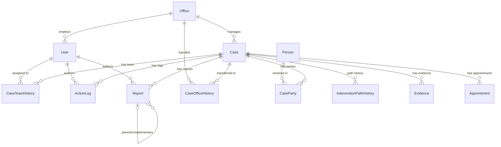

# DNA Case Management System - Schema v0

This document outlines the complete data model specification for the DNA (Defensoría de la Niñez y Adolescencia) case management system.

## Key Design Principles
*   **Case Ownership:** The case belongs to the NNA (child). Professionals and offices are temporary assignments.
*   **Immutability:** No report is ever edited once emitted. Only complementary reports can be added referencing the original.
*   **Traceability:** Reassigning professionals doesn't hide previous actions; they remain signed by their original author.
*   **Security:** All access to sensitive evidence is logged. Case closure requires Jefatura approval and blocks edits (read-only + justified reopening).
*   **Identifiers:** Primary Keys (PKs) are UUID v7 (chronologically sortable), except for `AuditLog`.
*   **Timestamps:** All tables have `createdAt` (TIMESTAMPTZ) and `updatedAt` (TIMESTAMPTZ).
*   **Deletion:** Soft delete is used where applicable (`isActive` or `deletedAt`).
*   **Conventions:** Prisma ORM conventions (camelCase columns).

---

## Mermaid ER Diagram

---

## Enums

| Enum Name | Values |
| :--- | :--- |
| `Role` | `ADMINISTRADOR`, `JEFATURA`, `ABOGADO`, `PSICOLOGO`, `SOCIAL`, `SECRETARIA`, `REFERENTE_TUTOR` |
| `DocumentType` | `CI`, `PASAPORTE`, `PARTIDA_NACIMIENTO`, `SIN_DOCUMENTO` |
| `Gender` | `MASCULINO`, `FEMENINO`, `OTRO` |
| `CaseType` | `DENUNCIA_VULNERACION`, `CONSUMO_SUSTANCIAS`, `VENTA_ALCOHOL`, `DERECHO_EDUCACION`, `EXTRAVIO`, `NNA_INFRACTOR`, `FISCALIZACION` |
| `Phase` | `DERIVACION`, `EVALUACION`, `SEGUIMIENTO`, `JUDICIALIZACION`, `CIERRE` |
| `InterventionPath` | `GESTION_ADMINISTRATIVA`, `CONCILIACION`, `VIA_JUDICIAL` |
| `RiskLevel` | `BAJO`, `MEDIO`, `ALTO` |
| `RoleInCase` | `NNA`, `DENUNCIANTE`, `DENUNCIADO`, `TUTOR`, `TESTIGO` |
| `ActionType` | `NOTA`, `ENTREVISTA`, `VISITA_DOMICILIARIA`, `AUDIENCIA`, `DERIVACION`, `CONTACTO_INSTITUCIONAL`, `OTRO` |
| `ReportType` | `INFORME_SOCIAL`, `INFORME_PSICOLOGICO`, `INFORME_PSICOSOCIAL`, `INFORME_JURIDICO` |
| `ReportStatus` | `BORRADOR`, `EMITIDO` |
| `AppointmentType`| `ENTREVISTA`, `AUDIENCIA`, `VISITA_DOMICILIARIA`, `SEGUIMIENTO`, `OTRO` |
| `AppointmentStatus`| `PROGRAMADA`, `COMPLETADA`, `CANCELADA`, `REPROGRAMADA` |
| `NotificationType`| `PLAZO_LEGAL`, `RIESGO_ALTO`, `ASIGNACION`, `DERIVACION`, `GENERAL` |
| `Priority` | `NORMAL`, `URGENTE`, `CRITICA` |
| `AuditAction` | `LOGIN`, `LOGOUT`, `CASE_CREATE`, `CASE_VIEW`, `CASE_UPDATE`, `TEAM_ASSIGN`, `TEAM_UNASSIGN`, `OFFICE_TRANSFER`, `REPORT_CREATE`, `REPORT_EMIT`, `EVIDENCE_UPLOAD`, `EVIDENCE_VIEW`, `EVIDENCE_DOWNLOAD`, `SECURITY_TOKEN_ACTIVATE`, `SECURITY_TOKEN_USE`, `CASE_CLOSE`, `CASE_REOPEN`, `USER_CREATE`, `USER_UPDATE`, `PERMISSION_CHANGE` |

---

## Tables

### 1. User
System users.
*   **id**: UUID v7, PK
*   **email**: String, unique
*   **passwordHash**: String
*   **firstName**: String
*   **lastName**: String
*   **role**: Enum `Role`
*   **officeId**: UUID, FK → Office, nullable (which office they belong to)
*   **isActive**: Boolean, default true
*   **lastLoginAt**: DateTime, nullable
*   **twoFactorEnabled**: Boolean, default false
*   **twoFactorSecret**: String, nullable
*   **createdAt**: DateTime (TIMESTAMPTZ)
*   **updatedAt**: DateTime (TIMESTAMPTZ)

### 2. Office
DNA offices (Central + 8 District offices in Sucre: `CENTRAL`, `DIST_1`, `DIST_2`, `DIST_3`, `DIST_4`, `DIST_5`, `DIST_6`, `DIST_7`, `DIST_8`).
*   **id**: UUID v7, PK
*   **name**: String (e.g., 'Defensoría Central Sucre', 'Defensoría Distrital 1 — Mercado Campesino')
*   **code**: String, unique (e.g., 'CENTRAL', 'DIST_1', ..., 'DIST_8')
*   **address**: String, nullable
*   **phone**: String, nullable
*   **isActive**: Boolean, default true
*   **createdAt**: DateTime (TIMESTAMPTZ)
*   **updatedAt**: DateTime (TIMESTAMPTZ)

### 3. Person
All people involved in cases (NNA, complainants, accused, guardians, witnesses).
*   **id**: UUID v7, PK
*   **documentType**: Enum `DocumentType`
*   **documentNumber**: String, nullable
*   **firstName**: String
*   **lastName**: String
*   **birthDate**: Date, nullable
*   **gender**: Enum `Gender`
*   **phone**: String, nullable
*   **address**: String, nullable
*   **notes**: Text, nullable
*   **createdAt**: DateTime (TIMESTAMPTZ)
*   **updatedAt**: DateTime (TIMESTAMPTZ)
*   **createdBy**: UUID, FK → User

### 4. Case
The central entity: one case per NNA situation.
*   **id**: UUID v7, PK
*   **caseCode**: String, unique (auto-generated: DNA-YYYY-NNNN)
*   **caseType**: Enum `CaseType`
*   **currentPhase**: Enum `Phase`
*   **currentInterventionPath**: Enum `InterventionPath`
*   **riskLevel**: Enum `RiskLevel`, nullable, set by psychology
*   **intakeNarrative**: Text (initial complaint narrative)
*   **isClosed**: Boolean, default false
*   **closedAt**: DateTime, nullable
*   **closedBy**: UUID, FK → User, nullable
*   **closureReason**: Text, nullable
*   **currentOfficeId**: UUID, FK → Office
*   **createdAt**: DateTime (TIMESTAMPTZ)
*   **updatedAt**: DateTime (TIMESTAMPTZ)
*   **createdBy**: UUID, FK → User

### 5. CaseParty
Polymorphic relationship: who is involved in each case and in what role.
*   **id**: UUID v7, PK
*   **caseId**: UUID, FK → Case
*   **personId**: UUID, FK → Person
*   **roleInCase**: Enum `RoleInCase`
*   **isPrimary**: Boolean (true for the primary NNA)
*   **createdAt**: DateTime (TIMESTAMPTZ)
*   **createdBy**: UUID, FK → User
*   *Constraint*: Unique (caseId, personId, roleInCase)

### 6. CaseTeamHistory
Who was assigned to the case, when, and why.
*   **id**: UUID v7, PK
*   **caseId**: UUID, FK → Case
*   **userId**: UUID, FK → User (the professional)
*   **role**: Enum `Role` (same as User.role)
*   **startDate**: DateTime
*   **endDate**: DateTime, nullable (null means currently assigned)
*   **reason**: Text (why assigned/unassigned)
*   **assignedBy**: UUID, FK → User (who made the assignment)
*   **createdAt**: DateTime (TIMESTAMPTZ)

### 7. CaseOfficeHistory
Which office handled the case, when, and why it was transferred.
*   **id**: UUID v7, PK
*   **caseId**: UUID, FK → Case
*   **officeId**: UUID, FK → Office
*   **startDate**: DateTime
*   **endDate**: DateTime, nullable
*   **reason**: Text
*   **transferredBy**: UUID, FK → User
*   **createdAt**: DateTime (TIMESTAMPTZ)

### 8. InterventionPathHistory
How the intervention path changed over time.
*   **id**: UUID v7, PK
*   **caseId**: UUID, FK → Case
*   **path**: Enum `InterventionPath`
*   **startDate**: DateTime
*   **endDate**: DateTime, nullable
*   **reason**: Text
*   **changedBy**: UUID, FK → User
*   **createdAt**: DateTime (TIMESTAMPTZ)

### 9. ActionLog
Chronological case activity log (bitácora). Append-only, immutable after signing.
*   **id**: UUID v7, PK
*   **caseId**: UUID, FK → Case
*   **authorId**: UUID, FK → User
*   **actionType**: Enum `ActionType`
*   **title**: String
*   **content**: Text
*   **isSigned**: Boolean, default false
*   **signedAt**: DateTime, nullable
*   **createdAt**: DateTime (TIMESTAMPTZ)
*   *Note*: Once `isSigned` is true, content cannot be modified. Before signing, the author can edit.

### 10. Report
Professional reports (social, psychological, psychosocial, legal).
*   **id**: UUID v7, PK
*   **caseId**: UUID, FK → Case
*   **authorId**: UUID, FK → User
*   **reportType**: Enum `ReportType`
*   **version**: Int, default 1 (increments for complementary reports)
*   **parentReportId**: UUID, FK → Report, nullable (references original if this is complementary)
*   **title**: String
*   **content**: Text (structured JSON or rich text)
*   **riskAssessment**: Enum `RiskLevel`, nullable (only for psychology reports)
*   **status**: Enum `ReportStatus`
*   **emittedAt**: DateTime, nullable
*   **createdAt**: DateTime (TIMESTAMPTZ)
*   **updatedAt**: DateTime (TIMESTAMPTZ)
*   *Note*: Once status is `EMITIDO`, content is frozen. New reports reference via `parentReportId`.

### 11. Evidence
Files attached to cases (documents, photos, audio, video).
*   **id**: UUID v7, PK
*   **caseId**: UUID, FK → Case
*   **uploadedBy**: UUID, FK → User
*   **fileName**: String
*   **mimeType**: String
*   **fileSize**: Int (bytes)
*   **storagePath**: String (MinIO object key)
*   **fileHash**: String (SHA-256)
*   **isSensitive**: Boolean, default false
*   **description**: Text, nullable
*   **createdAt**: DateTime (TIMESTAMPTZ)
*   *Note*: No update or delete. Evidence is immutable once uploaded.

### 12. Appointment
Calendar events tied to cases (not to professionals or offices).
*   **id**: UUID v7, PK
*   **caseId**: UUID, FK → Case
*   **title**: String
*   **description**: Text, nullable
*   **appointmentType**: Enum `AppointmentType`
*   **scheduledAt**: DateTime
*   **endAt**: DateTime, nullable
*   **location**: String, nullable
*   **status**: Enum `AppointmentStatus`
*   **createdBy**: UUID, FK → User
*   **createdAt**: DateTime (TIMESTAMPTZ)
*   **updatedAt**: DateTime (TIMESTAMPTZ)

### 13. Notification
In-app notifications with escalation.
*   **id**: UUID v7, PK
*   **userId**: UUID, FK → User (recipient)
*   **caseId**: UUID, FK → Case, nullable
*   **type**: Enum `NotificationType`
*   **title**: String
*   **message**: Text
*   **isRead**: Boolean, default false
*   **readAt**: DateTime, nullable
*   **priority**: Enum `Priority`
*   **expiresAt**: DateTime, nullable (for legal deadline alerts)
*   **escalatedTo**: UUID, FK → User, nullable (Jefatura if not addressed)
*   **escalatedAt**: DateTime, nullable
*   **createdAt**: DateTime (TIMESTAMPTZ)

### 14. AuditLog
Append-only, immutable audit trail.
*   **id**: BIGSERIAL (for pure append performance)
*   **userId**: UUID, FK → User
*   **userRole**: String (snapshot of role at time of action)
*   **action**: Enum `AuditAction`
*   **entityType**: String ('Case', 'Report', 'Evidence', etc.)
*   **entityId**: String (UUID of the affected entity)
*   **details**: JSONB (additional context)
*   **ipAddress**: String
*   **createdAt**: DateTime (TIMESTAMPTZ)
*   *Note*: NO UPDATE, NO DELETE permissions on this table for the application role.

### 15. SystemModule
Dynamic system modules and RBAC permission rules managed by the Administrator.
*   **id**: UUID v7, PK
*   **code**: String, UNIQUE (e.g. `MOD_DISTRICTS`, `MOD_USERS`, `MOD_INFRACTORES`)
*   **name**: String
*   **description**: Text, nullable
*   **permissions**: JSONB (Stores access level per role: ADMINISTRADOR, JEFATURA, ABOGADO, PSICOLOGO, SOCIAL, SECRETARIA)
*   **isCustom**: Boolean, default true (false for built-in core modules)
*   **createdAt**: DateTime (TIMESTAMPTZ)
*   **updatedAt**: DateTime (TIMESTAMPTZ)

### 16. SystemSetting
Global configurations (AI models, endpoints).
*   **key**: String, PK
*   **value**: String
*   **description**: Text, nullable
*   **updatedBy**: UUID, FK → User
*   **updatedAt**: DateTime (TIMESTAMPTZ)

### 17. SystemCatalog
Master catalogs for dropdowns and generic types (e.g., `VIOLENCE_TYPES`).
*   **id**: UUID v7, PK
*   **code**: String, UNIQUE
*   **name**: String
*   **description**: Text, nullable

### 18. CatalogItem
Values inside a catalog (e.g., `VIOLENCIA_FISICA` inside `VIOLENCE_TYPES`).
*   **id**: UUID v7, PK
*   **catalogId**: UUID, FK → SystemCatalog
*   **value**: String
*   **label**: String
*   **isActive**: Boolean, default true
*   **order**: Int, default 0

### 19. LegalDocument
Root entity for RAG knowledge base.
*   **id**: UUID v7, PK
*   **title**: String
*   **isActive**: Boolean, default true (allows soft-deleting superseded laws)
*   **version**: String, nullable
*   **createdAt**: DateTime (TIMESTAMPTZ)

### 20. LegalChunk
Vectorized chunks of legal documents.
*   **id**: UUID v7, PK
*   **legalDocumentId**: UUID, FK → LegalDocument
*   **content**: Text
*   **embedding**: Unsupported("vector(768)")
*   **metadata**: JSONB

---

## Indexes

Beyond standard PK and FK indexes, the following specialized indexes are applied to optimize queries:

*   **Case**:
    *   `idx_case_code`: `(caseCode)` - UNIQUE
    *   `idx_case_phase`: `(currentPhase)`
    *   `idx_case_risk`: `(riskLevel)`
    *   `idx_case_status`: `(isClosed)`
    *   `idx_case_office`: `(currentOfficeId)`
*   **CaseParty**:
    *   `idx_caseparty_unique`: `(caseId, personId, roleInCase)` - UNIQUE
*   **CaseTeamHistory**:
    *   `idx_caseteam_current`: `(caseId, endDate)` - Used for finding the currently assigned team members (where endDate is NULL).
*   **Notification**:
    *   `idx_notification_user_unread`: `(userId, isRead)` - Optimizes fetching unread notifications for a user.
    *   `idx_notification_expires`: `(expiresAt)` - Used for escalation cron jobs.
*   **AuditLog**:
    *   `idx_auditlog_entity`: `(entityType, entityId)` - For retrieving history of a specific record.
    *   `idx_auditlog_created`: `(createdAt)` - For time-based auditing and retention.

---

## RLS (Row-Level Security) Policies

Row-Level Security is implemented to enforce access controls natively in the database.

*   **Case Table**:
    *   `JEFATURA`: Can view all cases.
    *   `SECRETARIA`: Can view cases in their `currentOfficeId`.
    *   `ABOGADO`, `PSICOLOGO`, `SOCIAL`: Can view cases where they are actively assigned (via `CaseTeamHistory` where `endDate` is NULL) OR cases assigned to their `currentOfficeId`.
    *   *Updates*: Blocked for all roles if `isClosed = true`, except for `JEFATURA` to perform `CASE_REOPEN`.
*   **ActionLog & Report Tables**:
    *   Inherit view visibility from `Case`.
    *   *Updates*: Only the `authorId` can update their own `ActionLog` (if `isSigned = false`) or `Report` (if `status = 'BORRADOR'`). Once signed/emitted, UPDATE is restricted for everyone.
*   **Evidence Table**:
    *   Standard visibility inherited from `Case`.
    *   If `isSensitive = true`: Only `JEFATURA` or the currently assigned team (`CaseTeamHistory`) can view. Other office members cannot.
*   **AuditLog Table**:
    *   Application database role has `INSERT` and `SELECT` privileges only.
    *   `UPDATE` and `DELETE` are completely revoked for the application role.

---

## Audit Triggers

Database-level triggers are employed to automatically capture critical state changes without relying entirely on the application layer.

*   **Case Status Changes**: Triggers on `Case.isClosed` or `Case.currentPhase` changes to insert a row into `AuditLog`.
*   **Evidence Access**: (Implemented at application level usually, but DB function wraps read access to force an `EVIDENCE_VIEW` audit log entry if `isSensitive` is true).
*   **Report Emission**: Triggers on `Report.status` changing to `EMITIDO` to log `REPORT_EMIT` and freeze the record.
*   **Team Modifications**: Triggers on `CaseTeamHistory` inserts/updates to log `TEAM_ASSIGN` and `TEAM_UNASSIGN`.
*   **Office Transfers**: Triggers on `CaseOfficeHistory` to log `OFFICE_TRANSFER`.
