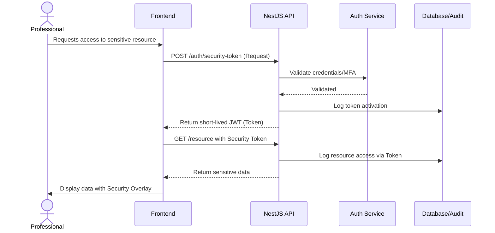

# Security and Access Control Model

This document outlines the comprehensive security, access control, and data protection model for the DNA case management system.

## 1. RBAC Matrix

The system uses a Role-Based Access Control (RBAC) model combined with Row-Level Security (RLS) to enforce fine-grained permissions.

### Legend
- ✅ Allowed
- ❌ Denied
- 🔒 Requires Security Token
- 📋 Only assigned cases

### Permissions Matrix

| Resource/Action | JEFATURA | ABOGADO | PSICOLOGO | SOCIAL | SECRETARIA | REFERENTE_TUTOR |
| :--- | :---: | :---: | :---: | :---: | :---: | :---: |
| **Cases** |
| Create | ✅ | ❌ | ❌ | ❌ | ✅ | ❌ |
| View Own | ✅ | 📋 | 📋 | 📋 | ✅ | 📋 (limited) |
| View All | ✅ | ❌ | ❌ | ❌ | ✅ | ❌ |
| Update | ✅ | 📋 | 📋 | 📋 | ✅ | ❌ |
| Close/Archive | ✅ | ❌ | ❌ | ❌ | ❌ | ❌ |
| Reopen | ✅ | ❌ | ❌ | ❌ | ❌ | ❌ |
| **Workflow** |
| Assign Team | ✅ | ❌ | ❌ | ❌ | ✅ | ❌ |
| Reassign Team | ✅ | ❌ | ❌ | ❌ | ✅ | ❌ |
| View Team Hist. | ✅ | 📋 | 📋 | 📋 | ✅ | ❌ |
| Transfer Office | ✅ | ❌ | ❌ | ❌ | ✅ | ❌ |
| View Transfer Hist.| ✅ | 📋 | 📋 | 📋 | ✅ | ❌ |
| **Reports** |
| Create/Edit Social| ✅ | ❌ | ❌ | 📋 | ❌ | ❌ |
| Emit Social | ✅ | ❌ | ❌ | 📋 | ❌ | ❌ |
| View Social | ✅ | 🔒+📋 | 🔒+📋 | 📋 | ❌ | ❌ |
| Create/Edit Psych | ✅ | ❌ | 📋 | ❌ | ❌ | ❌ |
| Emit Psych | ✅ | ❌ | 📋 | ❌ | ❌ | ❌ |
| View Psych | ✅ | 🔒+📋 | 📋 | 🔒+📋 | ❌ | ❌ |
| Create/Edit Legal | ✅ | 📋 | ❌ | ❌ | ❌ | ❌ |
| Emit Legal | ✅ | 📋 | ❌ | ❌ | ❌ | ❌ |
| View Legal | ✅ | 📋 | 🔒+📋 | 🔒+📋 | ❌ | ❌ |
| **Evidence** |
| Upload | ✅ | 📋 | 📋 | 📋 | ✅ | ❌ |
| View | ✅ | 📋 | 📋 | 📋 | ❌ | ❌ |
| Download | ✅ | 📋 | 📋 | 📋 | ❌ | ❌ |
| View Sensitive | ✅ | 🔒+📋 | 🔒+📋 | 🔒+📋 | ❌ | ❌ |
| **Action Log** |
| Create | ✅ | 📋 | 📋 | 📋 | ✅ | ❌ |
| View | ✅ | 📋 | 📋 | 📋 | ✅ | ❌ |
| Sign | ✅ | 📋 | 📋 | 📋 | ❌ | ❌ |
| **Appointments** |
| Create/Edit | ✅ | 📋 | 📋 | 📋 | ✅ | ❌ |
| View Own | ✅ | 📋 | 📋 | 📋 | ✅ | 📋 (limited) |
| View All | ✅ | ❌ | ❌ | ❌ | ✅ | ❌ |
| **System** |
| View Audit Log | ✅ | ❌ | ❌ | ❌ | ❌ | ❌ |
| Create/Edit Users | ✅ | ❌ | ❌ | ❌ | ❌ | ❌ |
| Deactivate Users | ✅ | ❌ | ❌ | ❌ | ❌ | ❌ |
| Manage Perms | ✅ | ❌ | ❌ | ❌ | ❌ | ❌ |
| View Own Notifs | ✅ | ✅ | ✅ | ✅ | ✅ | ✅ |
| Manage Notif Rules| ✅ | ❌ | ❌ | ❌ | ❌ | ❌ |
| Security Token | ✅ | ✅ | ✅ | ✅ | ❌ | ❌ |
| Config Token TTL | ✅ | ❌ | ❌ | ❌ | ❌ | ❌ |

> [!IMPORTANT]
> - Nobody can delete records from the system. Archival is the only authorized removal action and requires Jefatura approval.
> - Referente/Tutor views are strictly limited to phase status, next appointment, and supervised messaging.
> - Professionals strictly manage reports corresponding to their discipline.

## 2. PostgreSQL RLS Policies

Row-Level Security (RLS) ensures data isolation directly at the database level.

### RLS Enabled Tables
- `cases`
- `case_party`
- `reports`
- `evidence`
- `action_logs`
- `appointments`

### Policy Logic
Policies rely on session settings initialized per transaction:
- `current_setting('app.user_id')`
- `current_setting('app.user_role')`

Conceptual Policy for `cases` (View):
```sql
CREATE POLICY view_cases_policy ON cases
FOR SELECT
USING (
    current_setting('app.user_role') IN ('JEFATURA', 'SECRETARIA') 
    OR 
    EXISTS (
        SELECT 1 FROM case_team_history cth 
        WHERE cth.case_id = cases.id 
        AND cth.user_id = current_setting('app.user_id')::uuid
    )
);
```

### Jefatura Bypass
The `JEFATURA` role bypasses standard RLS constraints via policies that specifically check `current_setting('app.user_role') = 'JEFATURA'`, granting ubiquitous access to all records.

### NestJS Interceptor Pattern
A global NestJS interceptor wraps every request in a database transaction. Before executing application queries, it injects the current user's context into PostgreSQL settings:

```typescript
// Conceptual Interceptor
await prisma.$executeRawUnsafe(`
  SET LOCAL app.user_id = '${user.id}';
  SET LOCAL app.user_role = '${user.role}';
`);
```

## 3. Security Token (Token de Seguridad Documental)

To access sensitive clinical reports or evidence outside a professional's primary discipline, a temporary security token must be activated.

### Activation Flow



### Configuration
- **JWT Scopes**: `evidence:read`, `clinical:read`
- **TTL**: 15 minutes (default). Configurable globally by Jefatura.
- **Expiry Behavior**: When the token expires, an opaque overlay blocks the sensitive content immediately. The application does not forcibly close or navigate away, allowing the user to re-authenticate seamlessly.
- **Audit**: Every token generation and subsequent resource access using the token is strictly logged.

## 4. Audit Model

The system maintains a rigorous audit trail of all activities.

- **Automatic Logging (DB Triggers)**: All `INSERT`, `UPDATE`, and `DELETE` operations on core tables trigger PostgreSQL functions that record the old/new states, timestamps, and the `app.user_id` responsible for the change into the `audit_log` table.
- **Application Logging (NestJS Interceptor)**: High-level business events (e.g., login attempts, token activations, document downloads) are logged directly by the application tier.
- **Append-Only Guarantee**: The `audit_log` and `action_logs` tables enforce immutability at the database permissions level (`REVOKE UPDATE, DELETE ON audit_log FROM PUBLIC;`).
- **Retention Policy**: Audit logs are retained indefinitely.

## 5. Data Protection

Protecting sensitive NNA (Niños, Niñas y Adolescentes) data is paramount.

- **Encryption at Rest**: Implemented via filesystem-level encryption (e.g., LUKS) or PostgreSQL TDE if applicable, ensuring physical media security.
- **Encryption in Transit**: All communications between clients, the API, and the database are enforced over TLS 1.3.
- **On-Premise Mandate**: The infrastructure must be deployed on municipal servers. NNA data is strictly prohibited from leaving the municipal network boundaries or being hosted in public clouds.
- **Anonymization**: Any aggregate reporting or statistical exports automatically anonymize PII (Personally Identifiable Information).
- **Archival over Deletion**: Records are never hard-deleted. They are archived and require a double-verification process (Jefatura + secondary authorization) to be reopened.
